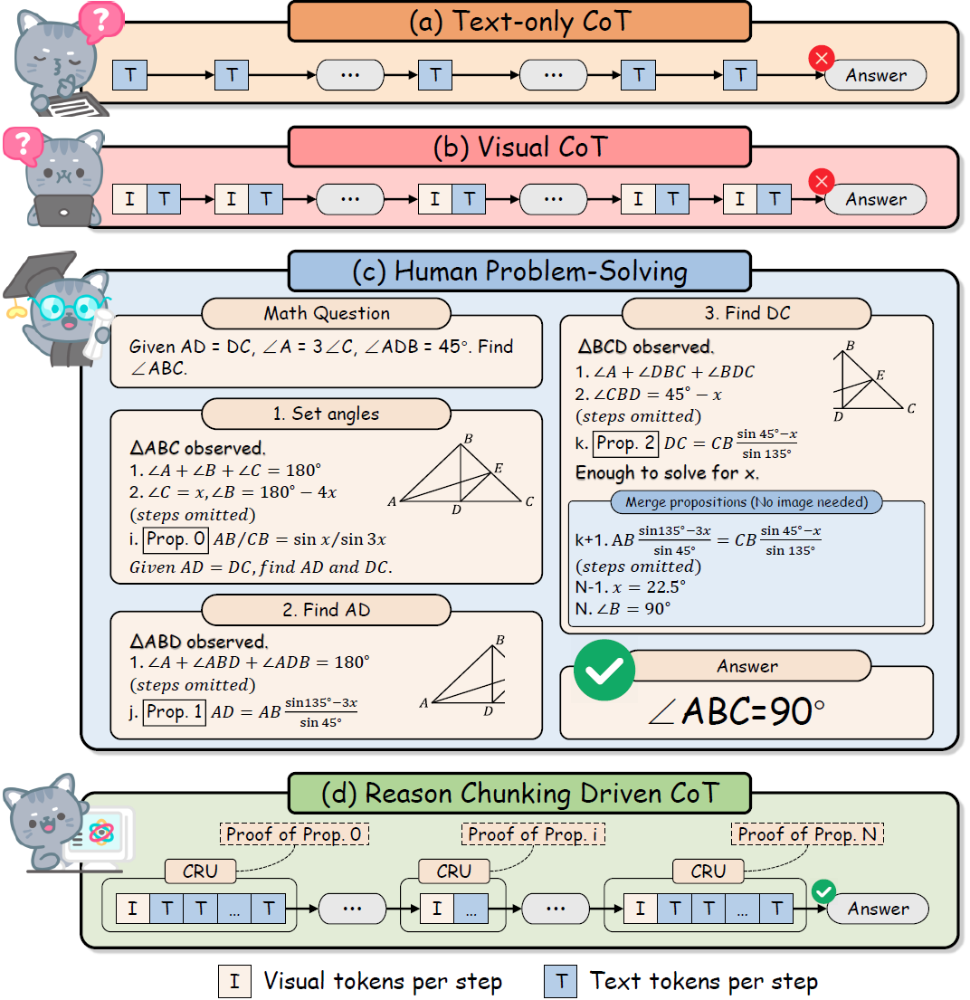
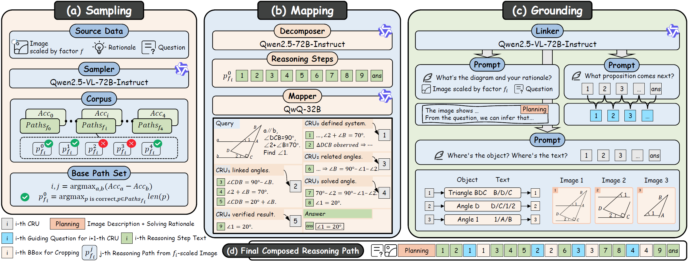
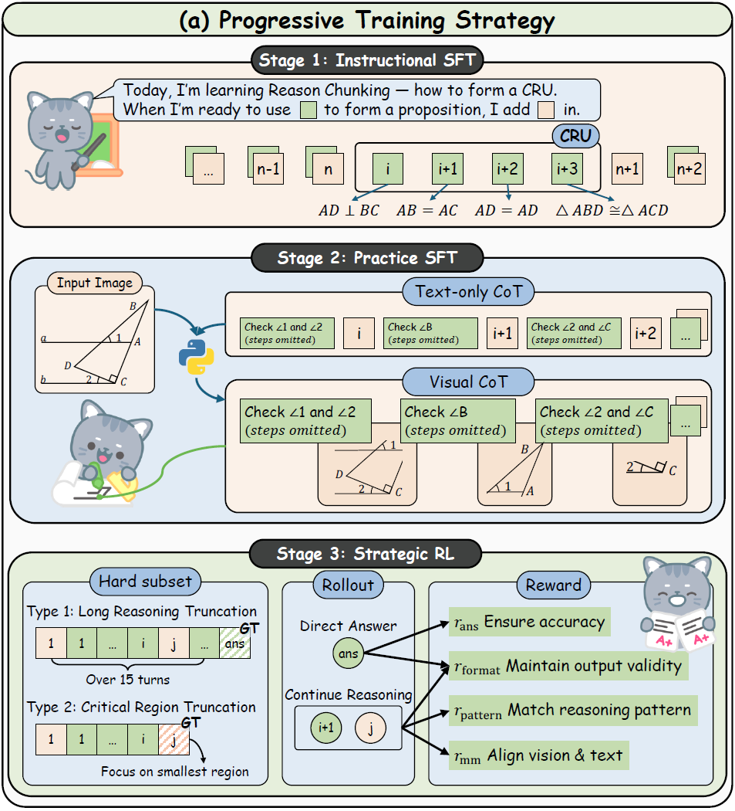

<div align="center">
  
  <h1 style="font-size: 32px; font-weight: bold;"> [CVPR 2026] VɪRC: Enhancing Visual Interleaved Mathematical CoT with Reason Chunking </h1>

  <a href="https://arxiv.org/abs/2512.14654v3"></a>
  <a href="https://huggingface.co/datasets/LeonMiao/CRUX"></a>
  <br>
  <a href="https://huggingface.co/LeonMiao/ViRC-7B"></a>
  <a href="https://huggingface.co/LeonMiao/ViRC-3B"></a>
  <a href="https://huggingface.co/LeonMiao/ViRC-Qwen2VL-7B"></a>
  <a href="https://huggingface.co/LeonMiao/ViRC-Qwen2VL-2B"></a>
</div>

## 💥 News

- **[2026.04.09]** We officially open-source the **CRUX dataset** and **ViRC models** as scheduled. 🚀
- **[2026.03.01]** The **CURX dataset** and **ViRC models** are ready and are currently **under internal review at Ant Group**. Full open-sourcing will be completed **no later than 2026.04.19**.⚡️
- **[2026.02.21]** ViRC has been accepted by **CVPR 2026**. 🎉
- **[2025.12.16]** We release the [arxiv paper](https://arxiv.org/abs/2512.14654v3) and the code. 🔥

## 👀 About VɪRC

Existing MLLMs typically perform textual reasoning solely from a single static mathematical image, overlooking dynamic visual acquisition during reasoning. In contrast, humans repeatedly examine visual image and employ step-by-step reasoning to prove intermediate propositions. We propose a **ViRC** framework for multimodal mathematical tasks, introducing a **Reason Chunking** mechanism that structures multimodal mathematical CoT into consecutive **C**ritical **R**easoning **U**nits (**CRU**s) to simulate human expert problem-solving patterns. CRUs ensure intra-unit textual coherence for intermediate proposition verification while integrating visual information across units to generate subsequent propositions and support structured reasoning.

<p align="center">
     <br>
</p>

To this end, we present **CRUX dataset** by using **three visual tools** and **four reasoning patterns** to provide explicitly annotated CRUs across multiple reasoning paths for each mathematical problem.

<p align="center">
     <br>
</p>

Leveraging the CRUX dataset, we propose a progressive training strategy inspired by human cognitive learning, which includes Instructional SFT, Practice SFT, and Strategic RL, aimed at further strengthening the Reason Chunking ability of the model.

<p align="center">
     <br>
</p>

The resulting ViRC-7B model achieves a 18.8% average improvement over baselines across multiple mathematical benchmarks and cross-domain high-resolution image benchmarks.

## 💪 Get Started

### Installation

Clone the repository:

```bash
git clone https://github.com/Leon-LihongWang/ViRC.git
cd ViRC
```

Create and activate a conda environment:

```bash
conda create -n virc python=3.10 -y
conda activate virc
```

Install additional dependencies:

```bash
bash src/setup.sh
```

### 🚀 Training

### Preparation

Download our [dataset](https://huggingface.co/datasets/LeonMiao/ViRC-100K), and extract `ViRC_images.tar.lz4`:

```bash
huggingface-cli repo download --repo-type dataset LeonMiao/CRUX --local-dir ./data
cd ./data && lz4 -d ViRC_images.tar.lz4 | tar -xf -
```

Download [Qwen2.5-VL-7B-Instruct](https://huggingface.co/Qwen/Qwen2.5-VL-7B-Instruct), which is the base model used for training.

```bash
huggingface-cli repo download --repo-type model Qwen/Qwen2.5-VL-7B-Instruct --local-dir ./model
```

#### Stage 1: Instructional SFT

```bash
cd ViRC
pip install datasets==3.6.0
DISABLE_VERSION_CHECK=1 llamafactory-cli train src/train/stage_1_InstrSFT.yaml
```

#### Stage 2: Practice SFT

```bash
DISABLE_VERSION_CHECK=1 llamafactory-cli train src/train/stage_2_PracSFT.yaml
```

#### Stage 3: Strategic RL

```bash
pip install datasets==4.0.0
# Start Qwen2.5-VL-72B-Instruct with vLLM, and update Lines 32, 36, and 37 accordingly (the model-related settings).
\cp -f src/train/reward_for_scale_dynamic.py ./verl/utils/reward_score/init.py
bash src/train/stage_3_StratRL
```

#### Notes on Training Config

- We provide `src/train/merge_rl_result.sh` to merge Strategic RL outputs and export the final model weights in **safetensors** format.  
- Our training data and scripts support **two image-resolution settings**:  
  - **Dynamic resolution** (for models such as **Qwen2.5VL**).  
  - **Fixed resolution** (images resized to **1000×1000**, for models such as **Qwen2VL/Qwen3VL**).  
  These are distinguished by the suffixes `_scale_dynamic` and `_scale_fixed` under `data/` and `src/`.  
- For reproducibility, we release a **50K subset** of the training data (suffix `_50K`) and the **full 100K set** (suffix `_100K`).

### 💫 Inference

We provide inference scripts for **two image-resolution settings**:

- **Dynamic resolution** (`src/evaluation/ViRC_scale_dynamic.py`): for [ViRC-7B](https://huggingface.co/LeonMiao/ViRC-7B) and [ViRC-3B](https://huggingface.co/LeonMiao/ViRC-3B), based on the **Qwen2.5-VL-Instruct** series.  
- **Fixed resolution (1000×1000)** (`src/evaluation/ViRC_scale_fixed.py`): for [ViRC-Qwen2VL-7B](https://huggingface.co/LeonMiao/ViRC-Qwen2VL-7B) and [ViRC-Qwen2VL-2B](https://huggingface.co/LeonMiao/ViRC-Qwen2VL-2B), based on the **Qwen2-VL-Instruct** series.

`src/evaluation/` also includes a sample input image (`image.png`) and an expected output example in `src/evaluation/response/` for a quick sanity check.

Start the ViRC model with **vLLM**, then run the evaluation script:

```bash
model_path=./ViRC/models/ViRC-7B
model_name=ViRC
tensor_parallel_size=4
port=8000

python -u -m vllm.entrypoints.openai.api_server \
  --model $model_path \
  --served-model-name $model_name \
  --dtype auto \
  --tensor-parallel-size $tensor_parallel_size \
  --gpu-memory-utilization 0.9 \
  --port $port

python src/evaluation/ViRC_scale_dynamic.py
```

### 🥳 Acknowledgements

We would like to thank [LLaMA-Factory](https://github.com/hiyouga/LLaMA-Factory) and [verl](https://github.com/verl-project/verl), upon which our repo is built.

## ✅ Citation

```
@article{wang2025virc,
  title={ViRC: Enhancing Visual Interleaved Mathematical CoT with Reason Chunking}, 
  author={Lihong, Wang and Liangqi, Li and Weiwei, Feng and Jiamin, Wu and Changtao, Miao and Tieru, Wu and Rui, Ma and Bo, Zhang and Zhe, Li},
  journal={arXiv preprint arXiv:2512.14654},
  year={2025}
}
```
